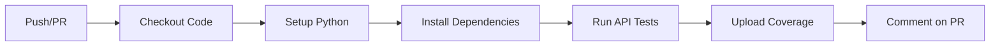
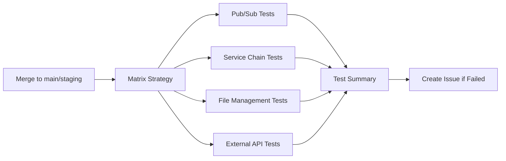

# CI/CD Pipeline Setup Guide

This guide explains how to set up and use the automated testing pipeline for your backend project.

## 🏗️ Pipeline Overview

Your CI/CD pipeline consists of two main workflows:

### 1. **API Testing Workflow** (`api-testing.yml`)
- **Trigger**: Runs on every push to any branch and on pull requests
- **Purpose**: Fast feedback on API functionality
- **Duration**: ~5-10 minutes
- **Tests**: All API endpoint tests in `tests/api_testing/`

### 2. **Integration Testing Workflow** (`integration-testing.yml`)
- **Trigger**: Runs on merges to `main` or `staging` branches
- **Purpose**: Comprehensive system integration validation
- **Duration**: ~15-30 minutes
- **Tests**: All integration tests in `tests/int_testing/`

## 🔧 Initial Setup

### Step 1: Configure GitHub Secrets

Navigate to your GitHub repository → Settings → Secrets and variables → Actions, then add these secrets:

#### Required Secrets:
```bash
# Google Cloud (for Pub/Sub integration tests)
GCP_PROJECT_ID=your-gcp-project-id
GCP_SA_KEY=your-service-account-json-key

# External API Keys (optional - tests will be skipped if not provided)
OPENAI_API_KEY=your-openai-api-key
AZURE_SPEECH_KEY=your-azure-speech-key
AZURE_SPEECH_REGION=your-azure-region
ASSEMBLYAI_API_KEY=your-assemblyai-key

# Database (optional - will use mock if not provided)
SUPABASE_URL=your-supabase-url
SUPABASE_KEY=your-supabase-key
```

#### Optional Secrets:
```bash
# For enhanced features
CODECOV_TOKEN=your-codecov-token  # For code coverage reports
SLACK_WEBHOOK_URL=your-slack-webhook  # For notifications
```

### Step 2: Enable GitHub Actions

1. Go to your repository → Actions tab
2. If prompted, click "I understand my workflows and want to enable them"
3. The workflows will automatically appear and be ready to run

### Step 3: Configure Branch Protection (Recommended)

1. Go to Settings → Branches
2. Add a branch protection rule for `main`:
   - Require status checks to pass before merging
   - Select "API Testing" as a required check
   - Require branches to be up to date before merging

## 🚀 How the Pipeline Works

### API Testing Workflow



**Triggered by:**
- Any push to any branch
- Any pull request creation/update

**What it does:**
1. Sets up Python 3.11 environment
2. Installs system dependencies (ffmpeg)
3. Installs Python dependencies from `requirements.txt`
4. Runs all tests in `tests/api_testing/` with mock credentials
5. Generates code coverage reports
6. Comments on PRs with test results

### Integration Testing Workflow



**Triggered by:**
- Merges to `main` or `staging` branches
- Manual workflow dispatch (with test category selection)

**What it does:**
1. Runs tests in parallel across 4 categories:
   - Pub/Sub message testing
   - Service chain testing
   - File management testing
   - External API testing
2. Uses real API credentials if available (skips tests if not)
3. Generates comprehensive test summary
4. Creates GitHub issues for failures
5. Uploads test artifacts for debugging

## 📊 Understanding Test Results

### API Test Results

**Success Indicators:**
- ✅ Green checkmark on commits/PRs
- Coverage report in PR comments
- All endpoint tests passing

**Failure Indicators:**
- ❌ Red X on commits/PRs
- Detailed error logs in workflow
- Failed test details in PR comments

### Integration Test Results

**Success Indicators:**
- ✅ All 4 test categories pass
- Comprehensive test summary
- No GitHub issues created

**Failure Indicators:**
- ❌ One or more test categories fail
- Automatic GitHub issue creation
- Detailed logs and artifacts available

## 🛠️ Manual Test Execution

### Run Specific Test Categories

You can manually trigger integration tests for specific categories:

1. Go to Actions → Integration Testing
2. Click "Run workflow"
3. Select the test category:
   - `all` (default)
   - `pubsub_message_testing`
   - `service_chain_testing`
   - `file_management_testing`
   - `externalAPI_testing`

### Local Testing Commands

```bash
# Run API tests locally
pytest tests/api_testing/ -v

# Run specific integration test category
pytest tests/int_testing/pubsub_message_testing/ -v
pytest tests/int_testing/service_chain_testing/ -v
pytest tests/int_testing/file_management_testing/ -v
pytest tests/int_testing/externalAPI_testing/ -v

# Run all integration tests
pytest tests/int_testing/ -v

# Run with coverage
pytest tests/api_testing/ --cov=app --cov-report=html
```

## 🔍 Troubleshooting

### Common Issues

#### 1. **API Tests Failing Due to Missing Dependencies**
```bash
# Solution: Add missing dependencies to requirements.txt
pip freeze > requirements.txt
```

#### 2. **Integration Tests Skipped Due to Missing API Keys**
```bash
# Solution: Add real API keys to GitHub Secrets
# Or run tests locally with environment variables
export OPENAI_API_KEY=your-key
pytest tests/int_testing/externalAPI_testing/
```

#### 3. **Google Cloud Authentication Errors**
```bash
# Solution: Verify GCP_SA_KEY secret is valid JSON
# Ensure service account has necessary permissions
```

#### 4. **Tests Timing Out**
```bash
# Solution: Increase timeout in workflow files
# Or optimize slow tests
```

### Debug Workflow Issues

1. **Check workflow logs:**
   - Go to Actions → Select failed workflow
   - Click on failed job
   - Expand failed step to see detailed logs

2. **Download test artifacts:**
   - Scroll to bottom of workflow run
   - Download artifacts for detailed test results

3. **Run tests locally:**
   ```bash
   # Replicate CI environment
   export TESTING=true
   export ENVIRONMENT=test
   pytest tests/api_testing/ -v --tb=short
   ```

## 📈 Monitoring and Metrics

### Test Coverage

- Coverage reports are generated for API tests
- Upload to Codecov for historical tracking
- Coverage thresholds can be configured

### Test Performance

- Test duration tracking with `--durations=10`
- Parallel execution for integration tests
- Caching for faster dependency installation

### Notifications

Configure notifications for test failures:

```yaml
# Add to workflow files for Slack notifications
- name: Notify Slack on failure
  if: failure()
  uses: 8398a7/action-slack@v3
  with:
    status: failure
    webhook_url: ${{ secrets.SLACK_WEBHOOK_URL }}
```

## 🔄 Workflow Customization

### Modify Test Triggers

**Change API test triggers:**
```yaml
# In .github/workflows/api-testing.yml
on:
  push:
    branches: [ "main", "develop" ]  # Only specific branches
  pull_request:
    branches: [ "main" ]  # Only PRs to main
```

**Change integration test triggers:**
```yaml
# In .github/workflows/integration-testing.yml
on:
  push:
    branches: [ "main" ]  # Only main branch
  schedule:
    - cron: '0 2 * * *'  # Daily at 2 AM
```

### Add New Test Categories

1. Create new test directory: `tests/int_testing/new_category/`
2. Add to integration workflow matrix:
   ```yaml
   matrix:
     test-category: 
       - pubsub_message_testing
       - service_chain_testing
       - file_management_testing
       - externalAPI_testing
       - new_category  # Add here
   ```

### Environment-Specific Configurations

```yaml
# Add environment-specific steps
- name: Setup staging environment
  if: github.ref == 'refs/heads/staging'
  run: |
    echo "ENVIRONMENT=staging" >> $GITHUB_ENV
```

## 📚 Best Practices

### 1. **Test Organization**
- Keep API tests fast and focused
- Use integration tests for complex workflows
- Mock external dependencies in API tests
- Use real APIs sparingly in integration tests

### 2. **Secret Management**
- Use GitHub Secrets for sensitive data
- Rotate API keys regularly
- Use least-privilege service accounts

### 3. **Performance Optimization**
- Cache dependencies between runs
- Run tests in parallel where possible
- Set appropriate timeouts
- Clean up test artifacts

### 4. **Monitoring**
- Monitor test execution times
- Track test failure rates
- Set up alerts for critical failures
- Review test coverage regularly

## 🆘 Support

If you encounter issues with the CI/CD pipeline:

1. Check this documentation first
2. Review workflow logs in GitHub Actions
3. Test locally to isolate issues
4. Check GitHub Secrets configuration
5. Verify API key permissions and quotas

---

*This CI/CD pipeline ensures code quality and system reliability through automated testing at every stage of development.* 